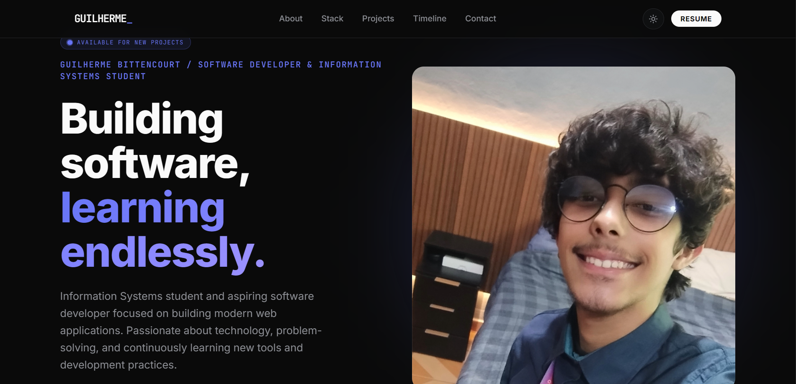

# 💼 Portfólio Pessoal

Meu portfólio pessoal desenvolvido para apresentar meus projetos, habilidades, tecnologias e trajetória na área de desenvolvimento de software.

## 🚀 Sobre o Projeto

Este site foi criado com o objetivo de reunir informações profissionais, projetos desenvolvidos, experiências acadêmicas e formas de contato em um único lugar.

## 🛠️ Tecnologias Utilizadas

- React
- TypeScript
- HTML5
- CSS3
- JavaScript
- Git & GitHub

## 📂 Funcionalidades

- Apresentação pessoal
- Exibição de projetos
- Lista de habilidades técnicas
- Informações de contato
- Design responsivo

## 🌐 Acesse

Caso o projeto esteja publicado:

[Portfólio Online]()

## 📸 Preview

```md

```

## ⚙️ Executando Localmente

Clone o repositório:

```bash
git clone https://github.com/guilhermebitt/portifolio.git
```

Acesse a pasta do projeto:

```bash
cd portifolio
```

Instale as dependências:

```bash
npm install
```

Execute o projeto:

```bash
npm run dev
```

## 📫 Contato

- GitHub: [/guilhermebitt](https://github.com/guilhermebitt)
- LinkedIn: [/guilherme-bitt](https://www.linkedin.com/in/guilherme-bitt/)
- E-mail: guilherme.assis.bittencourt@gmail.com

## 📄 Licença

Este projeto está licenciado sob a licença MIT.
